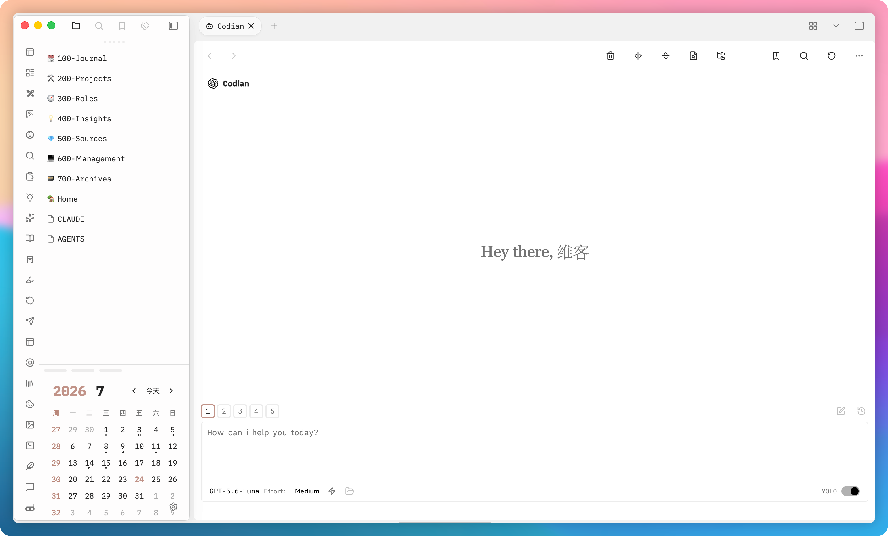

# Codian

[English](README.md) | [简体中文](README_ZH.md)

[](https://github.com/BCS1037/codian/releases)
[](LICENSE)
[](https://obsidian.md)



**Codian** is a desktop-only Obsidian plugin that embeds local coding agents into your sidebar chat and inline-edit workflow. Your Obsidian Vault acts as the agent's working directory (`pwd`): agents can read and edit files, run search, execute local tools, and perform multi-step coding tasks while preserving your note vault environment.

---

## ✨ Feature Highlights

- 💬 **Sidebar Chat Shell**: Multi-tab interface, saved conversations, fast session search, session resume, fork, rewind, and provider-native history replay.
- ✏️ **Inline Editing**: Inline prompt execution with real-time word-level diff previews directly in your active editor.
- 📝 **Live Markdown Composer**: Powered by CodeMirror 6 live preview, auto-completing `@note` and `@folder` mentions, drag-and-drop vault items, image attachments, and File Explorer "Add to Codian" integration.
- 🌐 **Third-Party Claude Service Profiles**: Built-in configuration profiles for China Science and Technology Cloud, Alibaba Bailian, Volcengine Ark Coding Plan, and custom Anthropic-compatible endpoints. API keys are safely managed via Obsidian `SecretStorage`.
- ⚙️ **Extensive Agent Ecosystem**: Full support for Agent Skills, MCP (Model Context Protocol) servers, subagents, tool execution approvals, and Plan/Thinking modes across 6 local CLI providers (`claude`, `codex`, `kimi`, `grok`, `opencode`, `pi`).
- 🛡️ **Privacy & Safety**: Operates directly with local provider CLIs. No third-party telemetry services.

---

## 📦 Requirements & Prerequisites

- **Obsidian**: Version 1.11.4 or later on macOS, Linux, or Windows.
- **Provider CLIs**: One or more installed provider CLIs available on your system `$PATH`:
  - [Claude Code](https://code.claude.com/docs/en/overview) (`claude`)
  - [Codex](https://github.com/openai/codex) (`codex`)
  - [Kimi Code](https://moonshotai.github.io/kimi-code/) (`kimi`)
  - [Grok](https://docs.x.ai/docs/grok-code-fast-1) (`grok`)
  - [OpenCode](https://opencode.ai/) (`opencode`)
  - [Pi](https://github.com/badlogic/pi-mono) (`pi`)
- **Node.js**: Node.js 24 (only required if building from source).

---

## 🚀 Installation

### Option 1: Obsidian Community Plugins (Recommended)
1. Open Obsidian **Settings** -> **Community plugins**.
2. Search for **Codian** (Plugin ID: `codianz`).
3. Click **Install**, then **Enable**.

### Option 2: Manual Installation (Release Build)
1. Download `main.js`, `manifest.json`, and `styles.css` from the latest [GitHub Release](https://github.com/BCS1037/codian/releases).
2. Open your Vault's plugin directory: `<vault>/.obsidian/plugins/codianz/` (create the `codianz` folder if it does not exist).
3. Copy the 3 downloaded files into that folder.
4. Reload Obsidian or toggle **Codian** on in Community plugins settings.

### Option 3: Build from Source (Developers)
```bash
git clone https://github.com/BCS1037/codian.git
cd codian
npm ci
npm run build
```
Copy the generated `main.js`, `manifest.json`, and `styles.css` to your vault's `.obsidian/plugins/codianz/` directory.

---

## ⚙️ Configuration & Third-Party Endpoints

Codian includes provider-neutral configuration controls under Obsidian Settings:

- **Third-Party Claude Profiles**: Configure custom Anthropic-compatible endpoints (e.g., Alibaba Bailian, Volcengine Ark, China Science & Technology Cloud) directly in the Claude Provider tab.
- **SecretStorage**: API keys and auth tokens are securely stored using Obsidian's native SecretStorage API rather than stored in plain text files.
- **Provider Connection Settings**: Configure absolute CLI executable paths or provider-specific parameters per provider under **Settings** -> **Provider** -> **Connection**.

---

## ❓ Frequently Asked Questions & Troubleshooting

### 1. Why does Codian report "CLI not detected"?
macOS GUI applications (launched via Finder or Dock) do not automatically inherit environment variables defined in Shell configuration files (e.g., `~/.zshrc` or `~/.bash_profile`).
- **Fix**: Go to Codian **Settings** -> **Provider** -> select the target Provider -> **Connection** tab, and enter the absolute file path to the CLI executable in **CLI Path** (e.g., `/usr/local/bin/claude` or `/opt/homebrew/bin/codex`).

### 2. How to set up Kimi Code CLI?
Kimi Code CLI requires an initial login before Codian can start an ACP session.
- **Fix**: Open your terminal, run `kimi`, and complete the interactive authentication process. Once configured, Codian will be able to discover models and connect successfully.

### 3. What is the difference between plugin ID `codianz` and display name `Codian`?
`codianz` is the unique internal plugin identifier registered with the Obsidian Community Plugin registry, while **Codian** is the user-visible display name. Always ensure your vault's plugin directory is named `codianz`.

---

## 🛠️ Development & Verification

```bash
# Install dependencies
npm ci

# Run type check, linter, and unit test suite
npm run verify

# Verify license boundaries and secret scanning
npm run security:audit
```

Please review [CONTRIBUTING.md](CONTRIBUTING.md) before submitting Pull Requests. Report security vulnerabilities privately per [SECURITY.md](SECURITY.md).

---

## 💖 Support & Sponsor

If you find Codian helpful and would like to support its ongoing maintenance and development of new features, you are welcome to sponsor me on [Afdian (爱发电)](https://afdian.com/a/bcs1037).

Thank you for your support! 🙏

---

## 🙏 Acknowledgments

Codian is built upon the foundation of [Claudian](https://github.com/YishenTu/claudian), created by [Yishen Tu](https://github.com/YishenTu). I am deeply grateful to Yishen Tu and the Claudian contributors for their pioneering work in bringing AI coding agents to Obsidian.

I also thank the authors and maintainers of all open-source dependencies and tools that make Codian possible.

---

## 📄 License & Attribution

Codian-authored and upstream-derived source code is licensed under the [MIT License](LICENSE).
See [NOTICE](NOTICE) for Claudian upstream attribution and [THIRD_PARTY_NOTICES.md](THIRD_PARTY_NOTICES.md) for third-party component notices.
